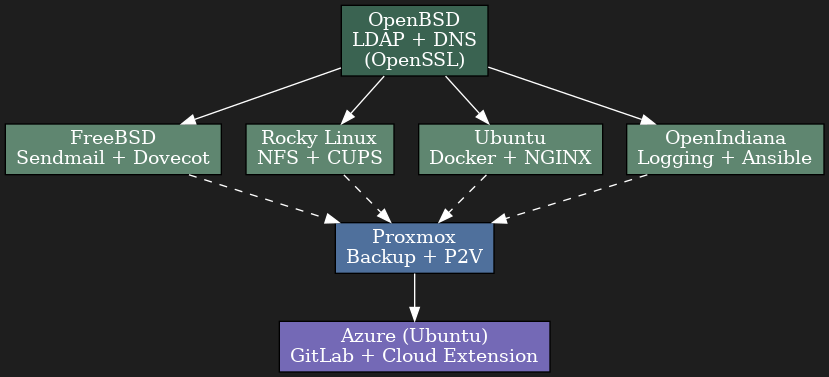

# Private VM-Based Network Infrastructure

A multi-OS virtual network project designed to simulate real-world enterprise infrastructure. Built from scratch using a collection of virtual machines (UTM/QEMU), running various UNIX-like operating systems. It includes essential services such as DNS, LDAP, NFS, Email, Web Hosting, and centralized configuration/logging, built across six operating systems.

---

## Systems and Roles

| OS | Role |
|----|------|
| **OpenBSD** | LDAP directory, DNS server (BIND9), OpenSSL for encryption |
| **FreeBSD** | Email server (Sendmail, Dovecot) |
| **Rocky Linux** | File server (NFS), Print server (CUPS) |
| **Ubuntu** | Web server (Nginx), Containers (Docker) |
| **OpenIndiana (Solaris-based)** | Log server and configuration automation (Ansible) |
| **Azure (Ubuntu)** | Public cloud hosting + GitLab instance |
| **Proxmox** | Backup, restore, P2V conversion, private cloud exploration |

---

## Key Features

- SSH key-based authentication across all VMs
- Centralized user authentication using OpenLDAP and OpenSSL
- Internal DNS management using BIND9
- Containerization via Docker on Ubuntu
- Web server hosting with NGINX
- Private cloud tools and P2V testing with Proxmox
- GitLab deployment on Azure for internal code repository
- Config management and logging using Ansible and OpenIndiana

---

## Technologies Used

OpenBSD, FreeBSD, Rocky Linux, Ubuntu, OpenIndiana, Azure, Proxmox  
LDAP, SSH, OpenSSL, BIND9, Docker, GitLab, NGINX, Sendmail, Dovecot, NFS, CUPS, Ansible

---

## Network Diagram



---

## Folder Structure

```bash
├── docs/                # Screenshots and documentation (Will be added soon!)
├── ansible/             # Playbooks for setup/management
├── services/            # Config files for DNS, NGINX, etc.
└── README.md
```

---

## License

MIT License